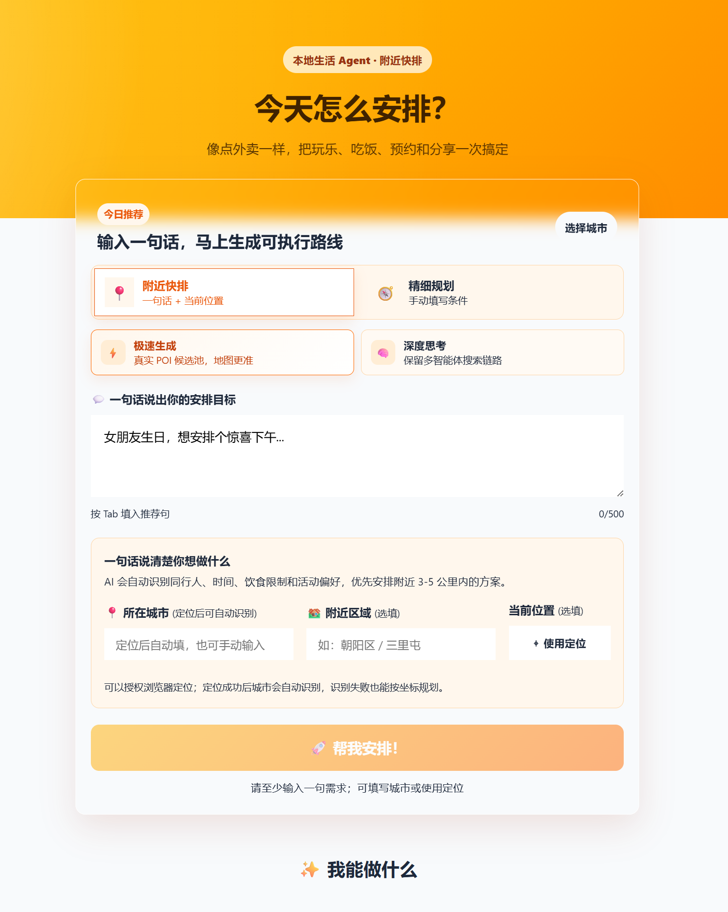
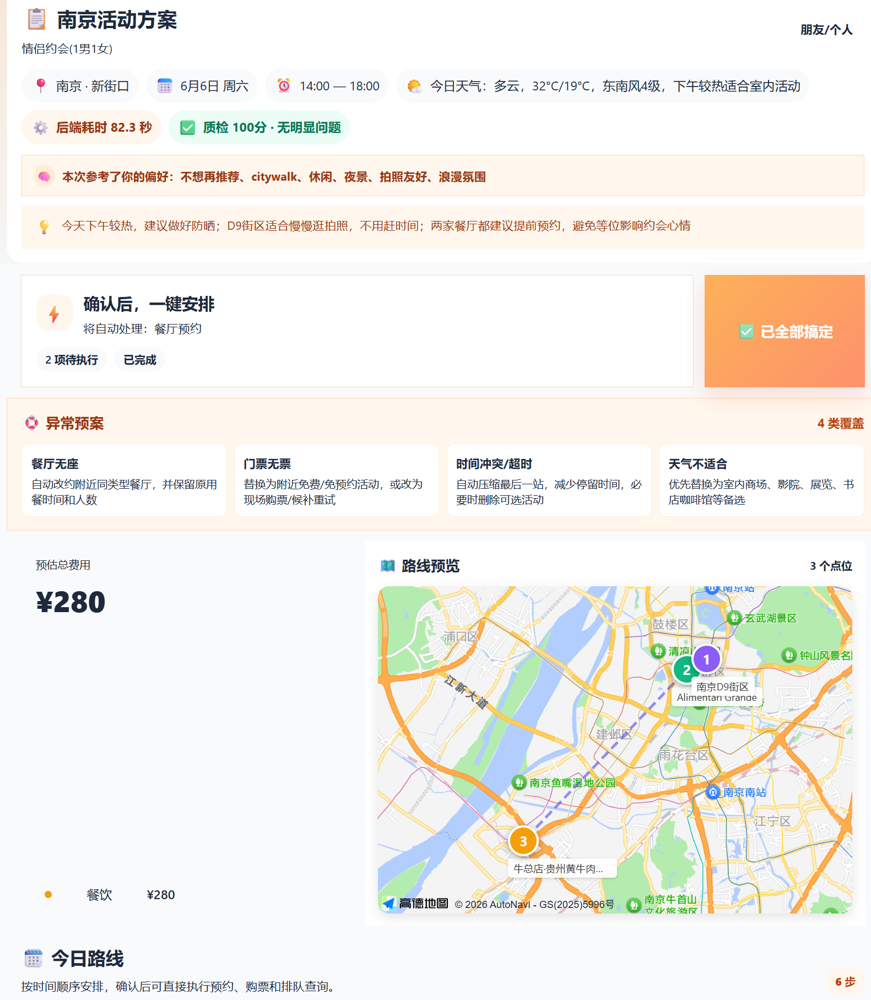
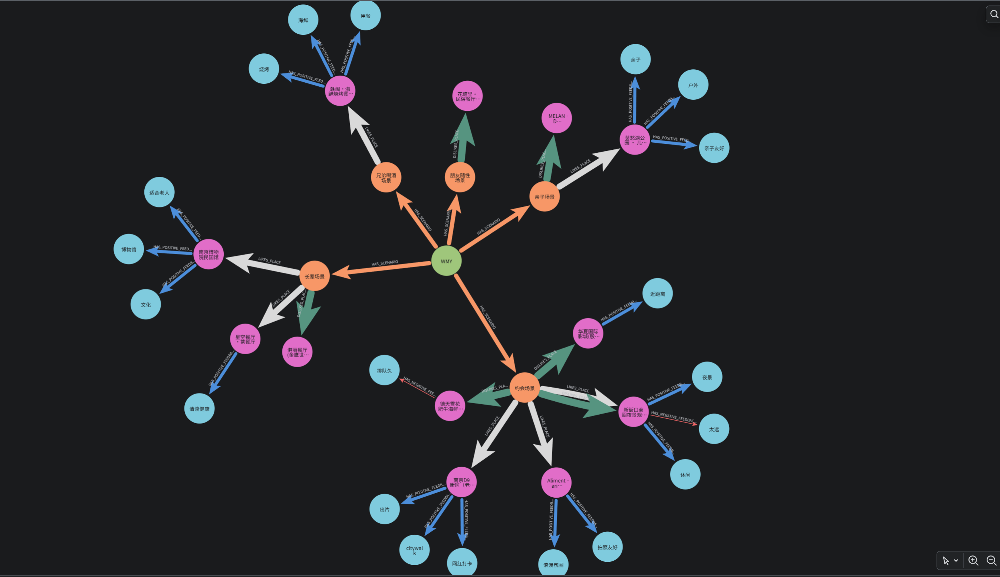
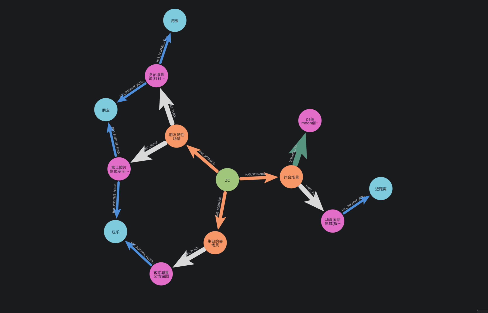
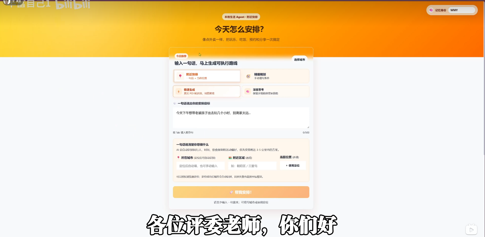

# SmartHorseKnowWay：本地活动规划与执行 Agent

> 说明项目能力、环境配置、一键启动、GitHub 提交注意事项和敏感信息保护。
## 可视化展示
### 前端表单展示

<p align="center">
  <b>前端表单提交页</b><br>
  
</p>

<br> <p align="center">
  <b>前端结果页展示</b>
</p>

| 前端结果页展示 1 | 前端结果页展示 2 |
| :---: | :---: |
|  |  |

<br>

### Graphrag记忆模块展示

<p align="center">
  <b>记忆结构知识图谱展示</b><br>
  
  
</p>
<br>

### 视频展示

点击下方图片观看 SmartHorseKnowWay 完整运行演示：

<p align="center">
  <a href="https://www.bilibili.com/video/BV1XCEx6yE7X/?share_source=copy_web&vd_source=4889e26ca66b597f59950b68749e3731" target="_blank">
    
  </a>
</p>
## 场景介绍与实现链路
SmartHorseKnowWay 是一个面向本地生活场景的活动规划与执行 Agent。用户输入一句自然语言目标，例如“晚上想和女朋友看电影再吃烧烤”“带爸妈孩子找个安静舒服的公园逛逛”，系统会自动识别人群、时间、场景、饮食和距离约束，结合高德地图、天气、Mock 预约/购票和 Graph Memory RAG，生成 4-6 小时左右的可执行活动方案。

项目支持两种规划入口：

- 附近快排：一句话 + 当前定位，快速生成附近可执行路线。
- 精细规划：手动填写城市、区域、时间、预算、群体条件。

项目支持两条执行链路：

- 极速生成 `fast`：轻量 LLM + 高德真实 POI 候选池 + 确定性排程，适合比赛 Demo。
- 深度思考 `agent`：HelloAgents 多智能体协作搜索和规划，适合展示 Agent 架构。

## 核心能力

- 一句话活动规划：自动解析时间、人群、地点、饮食、心情和活动目标。
- 真实 POI 落地：结果页地点、地址和坐标绑定高德 POI，避免虚构地点。
- 美团风结果页：路线卡片、预算、地图、质检、异常预案和一键安排。
- 一键执行闭环：餐厅预约、门票购买、排队查询、配送和分享均为 Mock API。
- 异常处理：餐厅无座、门票无票、时间冲突、天气不适合时给出备选策略。
- Graph Memory RAG：根据用户反馈沉淀用户级、场景级和对象级记忆。
- Neo4j 可选图谱：展示 `用户 -> 场景 -> 地点 -> 反馈标签` 的记忆画像。

## 项目结构

```text
SmartHorseKnowWay_agent/
├── backend/                  # FastAPI + HelloAgents 后端
│   ├── app/
│   │   ├── agents/           # 多智能体规划核心
│   │   ├── api/              # FastAPI 路由
│   │   ├── models/           # Pydantic 数据模型
│   │   └── services/         # 高德、Mock、记忆、Neo4j 等服务
│   ├── .env.example          # 后端环境变量模板
│   ├── requirements.txt
│   └── run.py
├── frontend/                 # Vue3 + TypeScript 前端
│   ├── src/
│   ├── .env.example          # 前端环境变量模板
│   └── package.json
├── docs/
│   ├── competition_design.md # 比赛设计说明
│   
├── setup.ps1                 # Windows 首次配置
├── setup.sh                  # Linux/macOS 首次配置
├── start_backend.ps1         # Windows 一键启动后端
├── start_frontend.ps1        # Windows 一键启动前端
├── start_all.ps1             # Windows 同时启动前后端
├── start_backend.sh          # Linux/macOS 一键启动后端
├── start_frontend.sh         # Linux/macOS 一键启动前端
├── start_all.sh              # Linux/macOS 同时启动前后端
└── README.md
```

## 环境要求

- Windows + PowerShell
- Python 3.10+
- Node.js 18+
- npm
- 高德开放平台 Key
- LLM API Key，例如 OpenAI 兼容接口、DeepSeek 等
- Neo4j Desktop，可选

## API 与环境变量配置

> 2026-06-06：仓库只提交 `.env.example`，真实 `.env` 由首次配置脚本在本地生成，避免把 API Key、Neo4j 密码和本地记忆数据库提交到 GitHub。

### 0. 首次自动配置

首次拉取仓库后，先运行一次配置脚本。脚本会自动完成：

- 复制 `backend/.env.example` 为 `backend/.env`
- 复制 `frontend/.env.example` 为 `frontend/.env`
- 创建后端 Python 虚拟环境 `backend/.venv`
- 根据 `backend/requirements.txt` 安装后端依赖
- 根据 `frontend/package.json` 安装前端依赖

Windows：

```powershell
cd XXXX项目目录
Set-ExecutionPolicy -Scope Process -ExecutionPolicy Bypass
.\setup.ps1
```

Linux / macOS：

```bash
cd xxxx项目目录
chmod +x setup.sh start_backend.sh start_frontend.sh start_all.sh
./setup.sh
安装npm可能会出现安装node版本不够的问题，可下载20.0以上版本的node
之后切换到前端文件夹cd SmartHorseKnowWay_agent\frontend
执行npm install 完成前端的依赖组件
```

配置脚本不会替你填写真实密钥。运行完成后，需要编辑下面两个文件：

```text
backend/.env
frontend/.env
```

### 1. 后端配置

如果没有运行 `setup.ps1` / `setup.sh`，也可以手动复制模板：

```powershell
cd xxxx项目目录
Copy-Item .env.example .env
```

编辑 `backend/.env`：

```env
LLM_MODEL_ID=your-model-name
LLM_API_KEY=your-api-key
LLM_BASE_URL=your-api-base-url
LLM_TIMEOUT=60

HOST=0.0.0.0
PORT=8000
CORS_ORIGINS=http://localhost:8888,http://localhost:3000
LOG_LEVEL=INFO

AMAP_API_KEY=your_amap_web_service_key

NEO4J_ENABLED=false
NEO4J_URI=neo4j://127.0.0.1:7687
NEO4J_USER=neo4j
NEO4J_PASSWORD=your_neo4j_password
NEO4J_DATABASE=neo4j
```

说明：

- `LLM_API_KEY`：大模型接口密钥。
- `LLM_BASE_URL`：OpenAI 兼容接口地址。
- `LLM_MODEL_ID`：模型名称。
- `AMAP_API_KEY`：高德 Web 服务 API Key，用于 POI、天气、定位反查。
- `NEO4J_ENABLED`：没有 Neo4j 时保持 `false`，系统仍可使用 SQLite 记忆。

### 2. 前端配置

复制模板：

```powershell
cd xxxx项目目录
Copy-Item .env.example .env
```

编辑 `frontend/.env`：

```env
VITE_API_BASE_URL=http://localhost:8000
VITE_AMAP_WEB_KEY=your_amap_web_service_key
VITE_AMAP_WEB_JS_KEY=your_amap_js_api_key
```

说明：

- `VITE_API_BASE_URL`：后端地址。
- `VITE_AMAP_WEB_JS_KEY`：高德 Web JS API Key，用于结果页地图。
- `VITE_AMAP_WEB_KEY`：预留给前端接口调用。

## 3. 端口号更改
```
这一条只适合不想采用默认端口号或者默认端口号被占用的情况
假设这是想要部署的本地端口号
后端： 8010
前端： 5173
须要更改三个地方
1. backend\.env 
  PORT=8010
  CORS_ORIGINS=http://localhost:5173,http://127.0.0.1:5173

2. frontend/.env
  VITE_API_BASE_URL=http://localhost:8010
  如果前端页面是在你自己电脑浏览器访问远程服务器，要写服务器地址：
  VITE_API_BASE_URL=http://你的服务器IP:8010

3.frontend/vite.config.ts 
  server: {
  host: '0.0.0.0',
  port: 5173,
  proxy: {
    '/api': {
      target: 'http://localhost:8010',
  如果你是远程 Linux 服务器，不是本机浏览器访问，还要把服务器 IP/域名加进去，例如
  frontend/vite.config.ts 
  server: {
  host: '0.0.0.0',
  port: 5173,
  allowedHosts: ['你的服务器IP'],
  proxy: {
    '/api': {
      target: 'http://localhost:8010',

```

## 一键启动本地服务

启动前请确认：

- `backend/.env` 已填写 `LLM_API_KEY`、`LLM_BASE_URL`、`LLM_MODEL_ID`、`AMAP_API_KEY`
- `frontend/.env` 已填写 `VITE_AMAP_WEB_JS_KEY`
- 如果启用 Neo4j，Neo4j Desktop 实例已经启动，且 `backend/.env` 中 `NEO4J_ENABLED=true`

### Windows PowerShell

推荐在项目根目录执行：

```powershell
cd xxxx项目目录
.\start_all.ps1
```

脚本会分别打开两个 PowerShell 窗口。日常启动脚本不会重复安装依赖；如果缺少 `.venv` 或 `node_modules`，请先运行 `setup.ps1`。

- 后端：http://127.0.0.1:8000
- 前端：http://127.0.0.1:8888

如果 PowerShell 阻止脚本运行，可以临时执行：

```powershell
Set-ExecutionPolicy -Scope Process -ExecutionPolicy Bypass
.\start_all.ps1
```

也可以分别启动：

```powershell
.\start_backend.ps1
.\start_frontend.ps1
```

### Linux / macOS

首次使用给脚本增加执行权限，已经运行过 `setup.sh` 的可以跳过：

```bash
cd xxxx项目目录
chmod +x start_backend.sh start_frontend.sh start_all.sh
```

一键启动：

```bash
./start_all.sh
```

日常启动脚本不会重复安装依赖；如果缺少 `.venv` 或 `node_modules`，请先运行 `./setup.sh`。

也可以分别启动：

```bash
./start_backend.sh
./start_frontend.sh
```

## 手动启动

### Windows 后端

```powershell
cd xxxx项目目录
python -m venv .venv
.\.venv\Scripts\activate
pip install -r requirements.txt
python run.py
若上面指令没反应也可以采取下面指令
uvicorn app.api.main:app --reload --host 0.0.0.0 --port 8000
```

### Windows 前端

```powershell
cd xxxx项目目录
npm install
npm run dev
```

### Linux / macOS 后端

```bash
cd xxxx项目目录
python3 -m venv .venv
source .venv/bin/activate
pip install -r requirements.txt
python run.py
若上面指令没反应也可以采取下面指令
uvicorn app.api.main:app --reload --host 0.0.0.0 --port 8000
```

### Linux / macOS 前端

```bash
cd xxxx项目目录
npm install
npm run dev
```

打开：

```text
http://127.0.0.1:8888
```

## Neo4j 可选配置

Neo4j 不是必须项。不开启时，SQLite 仍然会保存用户反馈和记忆。

如需开启：

1. 在 Neo4j Desktop 启动数据库实例。
2. 确认连接地址，例如：

```text
neo4j://127.0.0.1:7687
```

3. 修改 `backend/.env`：

```env
NEO4J_ENABLED=true
NEO4J_URI=neo4j://127.0.0.1:7687
NEO4J_USER=neo4j
NEO4J_PASSWORD=你的密码
NEO4J_DATABASE=localplan
```

## 常见问题

### 1. 地图不显示

检查 `frontend/.env` 的 `VITE_AMAP_WEB_JS_KEY` 是否正确，并重启前端。

### 2. 后端无法搜索地点

检查 `backend/.env` 的 `AMAP_API_KEY` 是否正确。

### 3. LLM 无法调用

检查 `LLM_API_KEY`、`LLM_BASE_URL`、`LLM_MODEL_ID` 是否匹配你的服务商。

### 4. Neo4j 连接失败

可以先把 `NEO4J_ENABLED=false`，不影响主流程。Neo4j 只作为图谱记忆展示增强。

## 许可

仅用于课程/比赛/学习展示。真实商户预约、支付和库存接口需要后续接入第三方平台。
