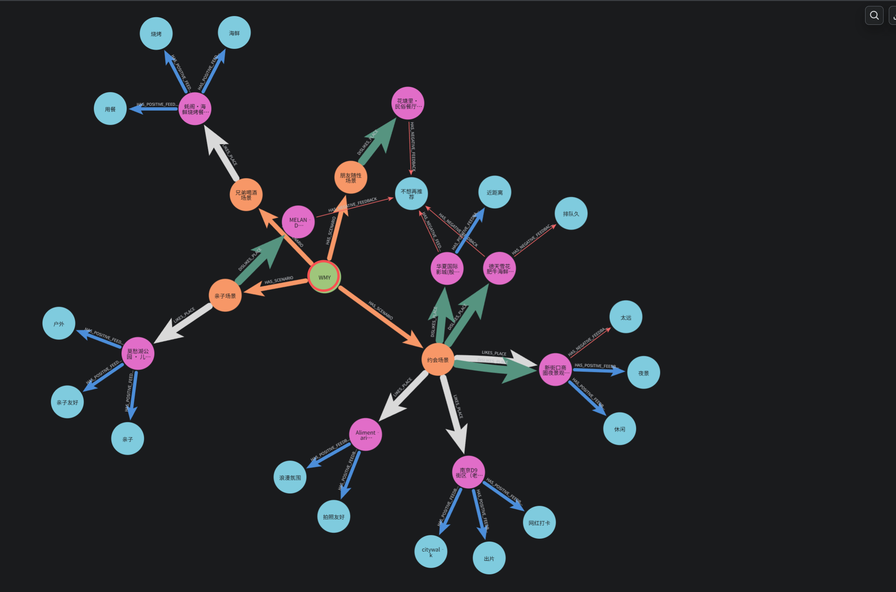
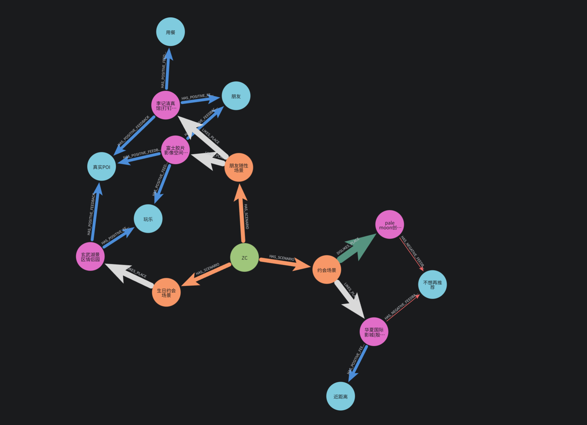

# SmartHorseKnowWay 本地活动规划与执行 Agent 设计说明

> 根据比赛要求整理 2-3 页设计文档，重点说明 Planning 策略、工具调用链、异常处理机制与记忆系统。

## 1. 项目目标

SmartHorseKnowWay 面向“周末/短时本地活动规划”场景，目标不是做一个搜索推荐列表，而是**构建一个能把事情安排完的本地生活** **Agent**。用户可以输入一句自然语言目标，例如“晚上想和女朋友看电影再吃烧烤”“带爸妈孩子找个安静舒服的地方走走”，系统自动识别人群、时间、场景、饮食和距离约束，输出 4-6 小时左右的可执行路线。

系统输出包括：真实地点、时间轴、路线地图、天气提示、预算估计、餐厅预约、门票购买、排队查询、分享文案和**异常备选**。用户确认后，可以通过 Mock API **演示“一键安排”闭环**；用户对推荐**不满意**时，也可以通过**自然语言反馈让系统记住偏好并影响下一次规划**（后面会介绍Memory系统）

### 前端表单展示

<p align="center">
  <b>前端表单提交页</b><br>
  
</p>

<br> <p align="center">
  <b>前端结果页展示</b>
</p>

| 前端结果页展示 1 | 前端结果页展示 2 |
| :---: | :---: |
|  |  |

<br>
## 2. 系统架构

系统采用前后端分离架构。前端使用 Vue3 + TypeScript，提供**“附近快排”和“精细规划**”两种入口，并展示美团本地生活风格的结果确认页。后端使用 FastAPI + HelloAgents，实现**多智能体规划、工具调用、规则质检、执行 Mock 和记忆检索**。

核心流程如下：

```text
用户输入
  -> 时间/硬需求解析
  -> ScenarioDetector 场景识别
  -> Graph Memory RAG 记忆检索
  -> 工具层并行搜索真实 POI / 天气 / 可用性
  -> Planner 生成方案
  -> 真实 POI 落地与规则质检
  -> 前端展示路线与一键执行
  -> 用户反馈写入记忆系统
```

工具层包括高德地图 POI 搜索、定位反查、天气查询，以及餐厅预约、门票购买、排队查询、配送、分享等 Mock API。**记忆层采用 SQLite 保存原始事件与结构化记忆**，**Neo4j 作为可选图谱展示层**，形成“用户 -> 场景 -> 地点 -> 反馈标签”的用户画像图。

## 3. Planning 策略

系统提供两个规划入口：

- 附近快排：用户只输入一句话，并可授权当前位置。系统**自动识别时间、人群、场景和偏好**，优先安排 3-5 公里内或同一区域内的活动。
- 精细规划：用户手动填写城市、区域、日期、开始时间、时长、预算和群体信息，适合需求明确的场景。

同时提供两条执行链路：

- **fast 极速生成**：轻量 LLM 抽取本次硬需求，例如“电影”“烧烤”“亲子”“失恋散心”；随后直接调用高德 REST POI 构建真实候选池，由轻量选择器在候选池中选点，再用确定性排程生成时间轴。该模式绕过 MCP 初始化和搜索 Agent，目标是**保证比赛 Demo 的速度**。
- agent 深度思考：保留多智能体协作链路，由意图 Agent、场所搜索 Agent、餐厅搜索 Agent、天气 Agent 和 Planner Agent 协同完成规划。该模式适合复杂约束与架构展示。为避免 LLM 自由编地点，深度模式输出后会再调用高德 POI 做真实地点落地。

时间解析采用规则优先策略。对于“下午1点到5点”“晚上出去转转”“上午想去玩几个小时”等表达，系统会覆盖默认表单时间。硬需求解析会把“看电影”“吃烧烤”等本次明确目标提取为最高优先级，**避免被历史记忆或通用约会偏好带偏**。

## 4. 工具调用链

Planning 阶段的工具调用分为搜索、约束补全和执行三类。

搜索与环境工具：

- 高德 POI 搜索：根据场景和硬需求搜索真实地点，例如电影院、烧烤、亲子乐园、咖啡馆、展览、公园。
- 定位反查：将浏览器经纬度反查为城市、区域和格式化地址。
- 天气查询：根据天气结果决定户外/室内策略。
- 餐厅可用性 Mock：批量模拟餐厅订位和排队情况。

执行工具：

- 餐厅预约：生成餐厅、人数、时间和联系人参数。
- 门票购买：生成场馆、票数和入场时间参数。
- 排队查询：展示餐厅等位状态。
- 配送下单：生日、纪念日等场景可生成蛋糕、鲜花配送动作。
- 分享消息：生成适合发给同伴的口语化安排。

为了控制耗时，普通 agent 模式中场所搜索、餐厅搜索、天气和可用性查询采用并行执行；fast 模式则直接走高德 REST 与 Mock 服务，避免 MCP 子进程初始化拖慢响应。

## 5. 质量控制与硬约束

系统在 Planner 之后设置了规则质检层 `RuleValidator`。质检覆盖以下维度：

设计初衷在于想把**agent改造成一个React+Reflection的反思型Agent结构**，因为比赛时间的约束和技术的限制，**故而考虑大局变成规则质检层**

- 结构完整性：是否包含城市、日期、时间轴、预算、执行动作、分享文案。
- 时间合理性：节点是否连续，总时长是否接近 4-6 小时，是否存在时间重叠或倒流。
- 地理一致性：地点是否与用户城市/区域一致，是否存在跨城地址。
- 活动组成：是否包含玩乐、餐饮和交通，不只是单点推荐。
- 执行闭环：餐饮节点是否有预约动作，购票节点是否有购票动作。
- 场景匹配：亲子场景避开酒吧/恐怖密室，失恋散心避开强社交与庆祝类安排。
- 真实 POI：非交通节点必须绑定真实高德 POI，包含具体名称、地址、坐标和可选 poi_id。

fast 模式只允许从真实高德候选池选点；如果真实 POI 不足，系统会返回候选不足的质检失败态，而不会生成“附近可预约餐厅”“待确认具体影院”等虚构地点。**agent 模式保留多智能体推理，但最终会执行真实 POI 落地，把 Planner 生成的泛化地点重新绑定到高德真实地点；绑定失败会进入质检错误**。

## 6. 异常处理机制

比赛要求覆盖**无座、无票、冲突等**异常。系统将异常处理显式展示在前端“异常预案”区域，并在执行结果中提供订单式状态流转：

```text
待确认 -> 执行中 -> 成功/失败 -> 重试/改用备选
```

当前覆盖的异常包括：

- 餐厅无座：预约失败时返回附近同类型或同场景备选餐厅，用户可点击“改用备选”重新执行。
- 门票无票：购票失败时返回免费或免预约活动作为替代。
- 时间冲突/超时：路线过长时可压缩最后一站、缩短停留或删除可选活动。
- 天气不适合：下雨、高温或强风时，优先替换为室内商场、影院、展览、书店咖啡馆。

**执行 API 为 Mock 实现，保证比赛演示不依赖真实商户接口，也能完整展示“规划 -> 确认 -> 下单/预约 -> 异常备选”的闭环**。

**以上信息均为模拟的数据，非真实情况，设计这是为了满足比赛需求**

## 7. Graph Memory RAG 记忆系统

记忆系统不保存完整聊天作为长期偏好，而是将用户输入、反馈和执行行为凝练为三层结构化记忆：

- **用户级**记忆：跨场景稳定偏好，例如少排队、不太远、轻松不折腾。
- **场景级**记忆：**只在当前场景下**使用，例如**约会喜欢出片，亲子喜欢儿童友好，朋友喝酒偏好夜宵**。
- **对象级**记忆：具体地点或餐厅的喜欢/避雷，例如某餐厅太贵、某公园适合孩子。

规划前，ScenarioDetector **先识别当前场景**，如 `couple_date`、`family_kid`、`friend_drink`、`solo_healing`。MemoryService **再按当前用户和场景检索相关记忆，形成 Graph Memory RAG 上下文注入 Planner**。这样系统能记住“这个用户不喜欢太远”，但***不会把“亲子餐厅”错误用于“兄弟喝酒”场景***。

### Graphrag记忆模块展示
图谱展示，分别为两位开发人员的个人偏好信息

<p align="center">
  <b>记忆结构知识图谱展示</b><br>
  
  
</p>
<br>

Neo4j 图谱结构为：

```text
User -> UserScenario -> Place -> Preference
```

例如：

```text
WMY -> 约会场景 -> 新街口商圈夜景观景点 -> 夜景 / 出片 / 太远
WMY -> 亲子场景 -> 莫愁湖公园 -> 亲子友好 / 户外
```

SQLite 负责可靠保存原始反馈事件和结构化记忆，**Neo4j 负责展示凝练后的图谱画像**。系统会过滤“真实POI”“交通”等内部技术标签，避免它们被误认为用户偏好。

## 8. 交互

前端结果页展示**路线卡片**、**预算**、**地图**、**质检状态**、**后端耗时**、**异常预案和一键执行按钮**。用户可以对**单个地点点击“换一个**”，***也可以对整套方案点击“换一套方案***”；***每张推荐卡支持自然语言反馈***，例如“这个太远了，不适合孩子，下次别推”，**反馈会进入记忆系统**。

部署上，后端 FastAPI 与前端 Vue 独立启动。Neo4j 是可选增强：未启动时系统仍使用 SQLite 记忆；配置 Neo4j 后，反馈会同步为用户画像图。**fast 模式目标控制在 10-30 秒内返回结果**，**agent 模式用于复杂需求和多智能体协作展示**。

当前边界是：预约、购票、排队和配送均为 Mock API；真实商户库存、支付和真实订单需要后续接入第三方本地生活平台。后续优化方向包括 LLM 语义质检自动修复、真实商户库存接入、**记忆系统的完善**、以及**fast模式准确性的完善**，以及**复杂agent的架构鲁棒性**和**响应速度**

